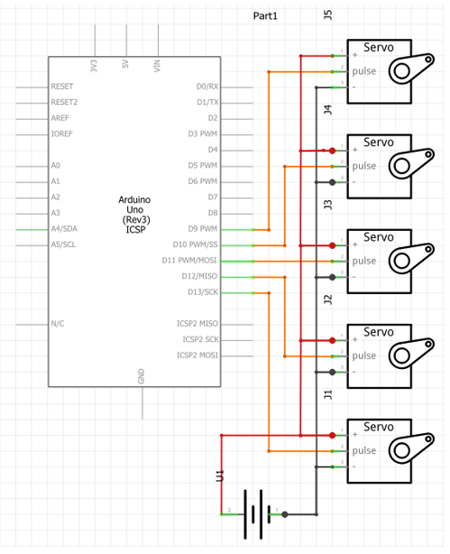

# Robotic hand controlled with computer vision

This is a robotic hand made by [InMoov](http://inmoov.fr/) 3D printed and assambled by me. Using an Arduino Uno to communicate on the serial port with my PC and a Python OpenCV project i got to control the hand only by using my camera

## Table of contents

- [Overview](#overview)
  - [Pictures](#pictures)
  - [Links](#links)
- [My process](#my-process)
	- [Electric part](#electric-part)
	- [3D printing](#3D-printing)
  	- [Built with](#built-with)
  	- [What I learned](#what-i-learned)
  	- [Continued development](#continued-development)
- [Author](#author)

## Overview

### Pictures

### Links

- InMoov website: [InMoov](http://inmoov.fr/)
- Arduino IDE: [Arduino](https://www.arduino.cc/en/software)
- Pycharm IDE: [Pychram](https://www.jetbrains.com/pycharm/)

## My process

### Electric part

### 3D printing

### Built with

- 3D printing
- Arduino
- Fritzing
- Pychram

### What I learned

I now have a greater and deeper understanding of the css flexbox and with mobile first workflow

### Continued development

In the future i would like to get even better at frond end development

## Author

- Balog Alin
- linkedIn - [@alinbalog](https://www.linkedin.com/in/alinbalog/)
- github - [@Fabzus](https://github.com/Fabzus)
- Frontend Mentor - [@Fabzus](https://www.frontendmentor.io/profile/Fabzus)
